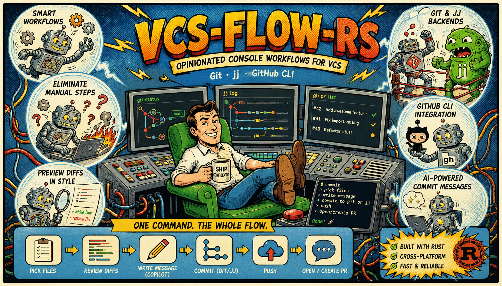

# vcs-flow-rs

Opinionated console workflows for Git, [jj](https://jj-vcs.github.io/jj/), and
the GitHub CLI.

A Cargo workspace of small, single-purpose command-line tools. Each one composes
a useful *sequence* of VCS operations — the kind you'd otherwise run by hand,
several commands at a time — into one binary. They are built on the typed VCS
clients [`vcs-git`](https://crates.io/crates/vcs-git),
[`vcs-jj`](https://crates.io/crates/vcs-jj),
[`vcs-github`](https://crates.io/crates/vcs-github), and the job-backed process
launcher [`processkit`](https://crates.io/crates/processkit).



## Tools

Each tool lives in its own `crates/<name>` member and has **its own README**
(linked below) covering usage, keybindings, configuration, and per-backend
behavior in depth. This page is the index; the crate READMEs are the manuals.

| Tool | Crate | Docs | What it does |
|---|---|---|---|
| `commit` | `vcs-flow-commit` | **[README »](crates/commit/README.md)** | Interactive TUI: pick changed files (ignoring the index), preview syntax-highlighted diffs, write a message (AI-drafted via Copilot), commit to **git** or **jj**, optionally push — then surface or create the GitHub PR. |

More tools land as their own `crates/<name>` member — add a row here and a
`crates/<name>/README.md` alongside it. All crates share one version and release
together.

## Build & run

```bash
cargo build                       # build the whole workspace
cargo run -p vcs-flow-commit      # run the commit tool (interactive)
cargo install --path crates/commit             # install `commit` onto your PATH
cargo test                        # all unit + integration tests
cargo clippy --all-targets -- -D warnings
cargo fmt --all --check
```

Tests that shell out to a real `git`/`jj`/`gh` binary are marked `#[ignore]` so
`cargo test` stays green on machines (and CI) without them; run them with
`cargo test -- --ignored`.

## Distribution

These tools are distributed three ways:

- **crates.io** — each tool is its own crate (binary name set via `[[bin]]`, so
  e.g. the `vcs-flow-commit` crate still installs as `commit`). All crates share
  one version and are published together by the release workflow.
- **npm** — thin wrapper packages ship the prebuilt static binary (planned; see
  the workspace track in `AGENTS.md`).
- **standalone executables** — `cargo build --release` / GitHub Release assets.

## License

MIT — see [LICENSE](LICENSE).
